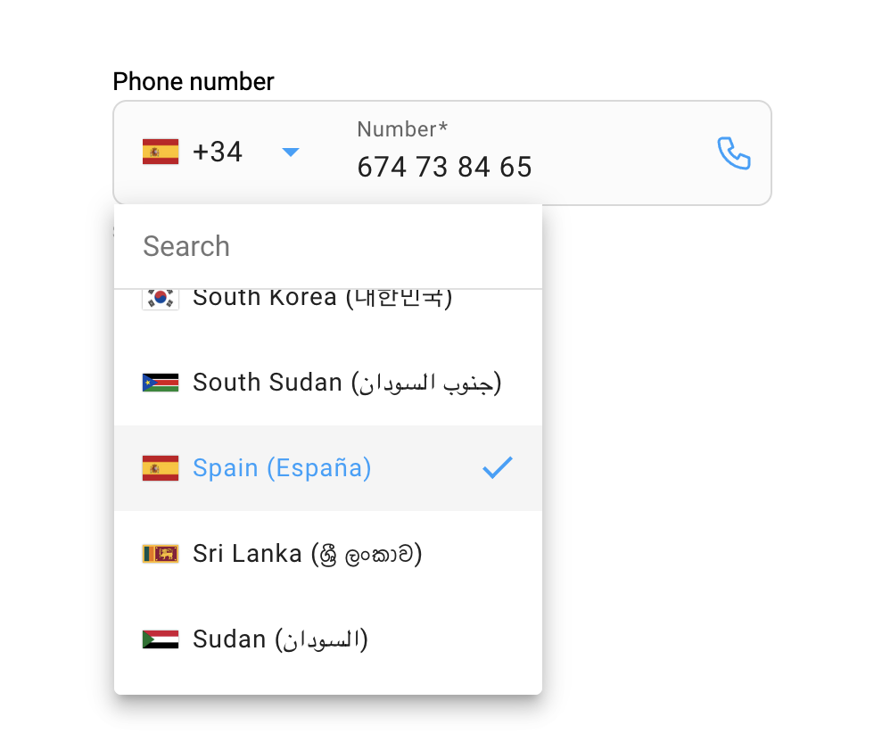

[](#contributors)

[](https://travis-ci.org/juanjotorres90/ngx-material-intl-tel-input) [](https://badge.fury.io/js/ngx-material-intl-tel-input) [](https://www.npmjs.com/package/ngx-material-intl-tel-input)

# NgxMaterialIntlTelInput

An Angular library for entering and validating international telephone numbers. It adds searchable material select to search for country codes, detects the user's country, displays a relevant placeholder and provides formatting/validation methods.



**Compatibility:**

Validation with [google-libphonenumber](https://github.com/ruimarinho/google-libphonenumber)

| ngx-material-intl-tel-input | Angular   |
| --------------------------- | --------- |
| 0.0.1 - 17.2.0              | >= 17.2.0 |

## Installation

`$ npm install ngx-material-intl-tel-input --save`

Make sure to add `provideAnimations()` in the providers array of your main.ts to bootstrap your application [Angular Docs](https://angular.io/api/platform-browser/animations/provideAnimations).

An Angular Material theme is required, the necessary css must be imported [Angular Material Theming](https://material.angular.io/guide/theming).

## Usage

### Import

Add the `NgxMaterialIntlTelInputComponent` to your imports array in the standalone component where it is going to be used.

```typescript
imports: [NgxMaterialIntlTelInputComponent];
```

## Example

```html
<form [formGroup]="formGroup">
  <ngx-material-intl-tel-input [formControl]="formControl" [required]="true" [autoIpLookup]="false"> </ngx-material-intl-tel-input>
</form>
```

## Options

| Options           | Type          | Default                                                                                                                                                                                                                                                                                                        | Description                                               |
| ----------------- | ------------- | -------------------------------------------------------------------------------------------------------------------------------------------------------------------------------------------------------------------------------------------------------------------------------------------------------------- | --------------------------------------------------------- |
| formControl       | `FormControl` | `FormControl('')`                                                                                                                                                                                                                                                                                              | Form control required to retrieve the value.              |
| required          | `boolean`     | `false`                                                                                                                                                                                                                                                                                                        | Telephone field input required.                           |
| disabled          | `boolean`     | `false`                                                                                                                                                                                                                                                                                                        | Telephone field input disabled.                           |
| autoIpLookup      | `boolean`     | `true`                                                                                                                                                                                                                                                                                                         | Sets initial country code based on user's ip.             |
| enablePlaceholder | `boolean`     | `true`                                                                                                                                                                                                                                                                                                         | Input placeholder text for every country national number. |
| iconMakeCall      | `boolean`     | `true`                                                                                                                                                                                                                                                                                                         | Click on phone icon to trigger call action.               |
| initialValue      | `string`      | ``                                                                                                                                                                                                                                                                                                             | Sets initial telephone number value                       |
| textLabels        | `TextLabels`  | `{mainLabel: 'Phone number', codePlaceholder: 'Code', searchPlaceholderLabel: 'Search', noEntriesFoundLabel: 'No countries found', nationalNumberLabel: 'Number', hintLabel: 'Select country and type your phone number', invalidNumberError: 'Number is not valid', requiredError: 'This field is required`}` | Overrides all component text labels                       |

## Contribute and develop locally

<a alt="Nx logo" href="https://nx.dev" target="_blank" rel="noreferrer"></a>

✨ **This workspace has been generated by [Nx, Smart Monorepos · Fast CI.](https://nx.dev)** ✨

## Integrate with editors

Enhance your Nx experience by installing [Nx Console](https://nx.dev/nx-console) for your favorite editor. Nx Console
provides an interactive UI to view your projects, run tasks, generate code, and more! Available for VSCode, IntelliJ and
comes with a LSP for Vim users.

## Prepare dependencies

To start your development once you have cloned this project, you must execute:

- Using Nodejs:

Node 20 is required.

```bash
npm install --legacy-peer-deps
```

- Using bun:

```bash
curl -fsSL https://bun.sh/install | bash
bun install
```

## Start the application

Run `npx nx serve ngx-material-intl-tel-input` to start the development server. Happy coding!

## Build for production

Run `npx nx build ngx-material-intl-tel-input-lib` to build the library. The build artifacts are stored in the output directory (e.g. `dist/` or `build/`), ready to be deployed.

## Contributors

Thanks goes to these wonderful people:

<!-- ALL-CONTRIBUTORS-LIST:START - Do not remove or modify this section -->
<!-- prettier-ignore-start -->
<!-- markdownlint-disable -->
<table>
  <tr>
    <td align="center"><a href="https://github.com/juanjotorres90"><br /><sub><b>Juanjo Torres</b></sub></a><br /><a href="#design-juanjotorres90" title="Design">🎨</a> <a href="https://github.com/juanjotorres90/ngx-material-intl-tel-input/commits?author=juanjotorres90" title="Code">💻</a> <a href="https://github.com/juanjotorres90/ngx-material-intl-tel-input/commits?author=juanjotorres90" title="Documentation">📖</a> <a href="#ideas-juanjotorres90" title="Ideas, Planning, & Feedback">🤔</a> <a href="#question-juanjotorres90" title="Answering Questions">💬</a> <a href="#infra-juanjotorres90" title="Infrastructure (Hosting, Build-Tools, etc)">🚇</a> <a href="#example-juanjotorres90" title="Examples">💡</a> <a href="#maintenance-juanjotorres90" title="Maintenance">🚧</a> <a href="https://github.com/juanjotorres90/ngx-material-intl-tel-input/pulls?q=is%3Apr+reviewed-by%3Ajuanjotorres90" title="Reviewed Pull Requests">👀</a> <a href="https://github.com/juanjotorres90/ngx-material-intl-tel-input/commits?author=juanjotorres90" title="Tests">⚠️</a></td>
</table>

<!-- markdownlint-restore -->
<!-- prettier-ignore-end -->

<!-- ALL-CONTRIBUTORS-LIST:END -->

This project follows the [all-contributors](https://github.com/all-contributors/all-contributors) specification. Contributions of any kind are welcome!
