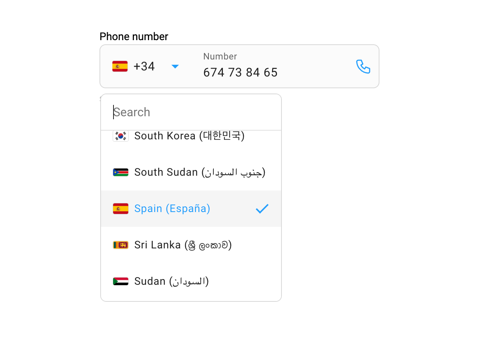

[](#contributors)

[](https://www.npmjs.com/package/ngx-material-intl-tel-input)
[](https://www.npmjs.com/package/ngx-material-intl-tel-input)
[](https://www.npmjs.com/package/ngx-material-intl-tel-input)

# NgxMaterialIntlTelInput

An Angular Material international telephone input with country search, number
formatting, validation, masking, localization, and optional GeoIP country
detection.

[Live demo](https://ngx-material-intl-tel-input.vercel.app/) ·
[npm](https://www.npmjs.com/package/ngx-material-intl-tel-input) ·
[source](https://github.com/juanjotorres90/ngx-material-intl-tel-input)



Validation and formatting are powered by
[`google-libphonenumber`](https://github.com/ruimarinho/google-libphonenumber).

## Compatibility

| ngx-material-intl-tel-input | Angular |
| --------------------------- | ------- |
| 22.0.0                      | 22      |
| 21.0.0 - 21.1.0             | 21      |
| 20.0.0 - 20.1.2             | 20      |
| 19.0.0 - 19.2.1             | 19      |
| 18.0.0 - 18.2.1             | 18      |
| 0.0.1 - 17.3.0              | 17      |

This project is unrelated to `ngx-intl-tel-input`, `ngx-mat-input-tel`, and
`intl-tel-input`.

## Installation

```bash
npm install ngx-material-intl-tel-input
```

Your application must include an
[Angular Material theme](https://material.angular.dev/guide/theming).

## Quick start

Import the standalone component and `ReactiveFormsModule`:

```typescript
import { ChangeDetectionStrategy, Component, inject } from '@angular/core';
import { FormBuilder, ReactiveFormsModule, Validators } from '@angular/forms';
import { NgxMaterialIntlTelInputComponent } from 'ngx-material-intl-tel-input';

@Component({
  selector: 'app-contact-form',
  imports: [ReactiveFormsModule, NgxMaterialIntlTelInputComponent],
  templateUrl: './contact-form.component.html',
  changeDetection: ChangeDetectionStrategy.OnPush
})
export class ContactFormComponent {
  private readonly formBuilder = inject(FormBuilder);

  readonly form = this.formBuilder.group({
    phone: ['', Validators.required]
  });
}
```

```html
<form [formGroup]="form">
  <ngx-material-intl-tel-input fieldControlName="phone"></ngx-material-intl-tel-input>
</form>
```

### Reactive Forms contract

The component is **not** a `ControlValueAccessor`; it does not register
`NG_VALUE_ACCESSOR`. Do not place `formControlName` or `[formControl]` directly
on `<ngx-material-intl-tel-input>`.

Instead, keep the component inside a parent form container and use one of:

- `fieldControlName="phone"` to resolve the control from the parent
  `[formGroup]`; or
- `[fieldControl]="form.controls.phone"` to pass the control explicitly.

The supplied control remains the source of truth for its value, validation,
dirty state, and disabled state. The `current*` events are optional
notifications.

```html
<form [formGroup]="form">
  <ngx-material-intl-tel-input [fieldControl]="form.controls.phone" [autoIpLookup]="false"></ngx-material-intl-tel-input>
</form>
```

### Signal Forms

The component implements the Signal Forms `FormValueControl<string>` contract,
so it can be bound directly to a field with the `[formField]` directive — no
`fieldControl` or parent `[formGroup]` needed:

```typescript
import { ChangeDetectionStrategy, Component, signal } from '@angular/core';
import { form, FormField, FormRoot, required, validate } from '@angular/forms/signals';
import { NgxMaterialIntlTelInputComponent, validPhoneNumber } from 'ngx-material-intl-tel-input';

@Component({
  selector: 'app-contact-form',
  imports: [FormRoot, FormField, NgxMaterialIntlTelInputComponent],
  templateUrl: './contact-form.component.html',
  changeDetection: ChangeDetectionStrategy.OnPush
})
export class ContactFormComponent {
  readonly model = signal({ phone: '' });
  readonly form = form(this.model, (path) => {
    required(path.phone);
    validate(path.phone, validPhoneNumber);
  });
}
```

```html
<form [formRoot]="form">
  <ngx-material-intl-tel-input [formField]="form.phone"></ngx-material-intl-tel-input>
</form>
```

The exported `validPhoneNumber` schema validator checks the emitted
international number with `google-libphonenumber` and reports an
`invalidNumber` error kind. Empty values are left to `required()`. Schema
`disabled(...)` and `required(...)` rules are reflected in the Material field,
and the field is marked touched on blur.

## Options

### Form state

| Input              | Type                                     | Default           | Purpose                              |
| ------------------ | ---------------------------------------- | ----------------- | ------------------------------------ |
| `fieldControl`     | `FormControl \| AbstractControl \| null` | `FormControl('')` | Explicit form control.               |
| `fieldControlName` | `string`                                 | `''`              | Control name in the parent form.     |
| `required`         | `boolean`                                | `false`           | Adds/removes `Validators.required`.  |
| `disabled`         | `boolean`                                | `false`           | Disables/enables the control and UI. |
| `initialValue`     | `string`                                 | `''`              | Initial telephone number.            |

### Country selection

| Input                  | Type                       | Default | Purpose                            |
| ---------------------- | -------------------------- | ------- | ---------------------------------- |
| `autoIpLookup`         | `boolean`                  | `false` | Detects the initial country by IP. |
| `autoSelectCountry`    | `boolean`                  | `true`  | Selects a country during startup.  |
| `autoSelectedCountry`  | `CountryISO \| string`     | `''`    | Preferred startup country.         |
| `preferredCountries`   | `(CountryISO \| string)[]` | `[]`    | Pins countries to the top.         |
| `visibleCountries`     | `(CountryISO \| string)[]` | `[]`    | Restricts available countries.     |
| `excludedCountries`    | `(CountryISO \| string)[]` | `[]`    | Removes countries from the list.   |
| `localizeCountryNames` | `boolean`                  | `false` | Uses locale-aware country names.   |

### Number handling

| Input                      | Type                | Default                           | Purpose                                 |
| -------------------------- | ------------------- | --------------------------------- | --------------------------------------- |
| `numberValidation`         | `boolean`           | `true`                            | Enables libphonenumber validation.      |
| `includeDialCode`          | `boolean`           | `false`                           | Includes the dial code in the input.    |
| `useMask`                  | `boolean`           | `false`                           | Enables country-specific input masks.   |
| `forceSelectedCountryCode` | `boolean`           | `false`                           | Keeps the country code in masked input. |
| `showMaskPlaceholder`      | `boolean`           | `false`                           | Shows placeholder mask characters.      |
| `outputNumberFormat`       | `PhoneNumberFormat` | `PhoneNumberFormat.INTERNATIONAL` | `INTERNATIONAL`, `E164`, or `RFC3966`.  |
| `enableInputMaxLength`     | `boolean`           | `true`                            | Applies a country-aware max length.     |

### Presentation

| Input               | Type                  | Default          | Purpose                                  |
| ------------------- | --------------------- | ---------------- | ---------------------------------------- |
| `appearance`        | `'fill' \| 'outline'` | `'fill'`         | Material form-field appearance.          |
| `enablePlaceholder` | `boolean`             | `true`           | Shows the country's number placeholder.  |
| `enableSearch`      | `boolean`             | `true`           | Enables country search.                  |
| `emojiFlags`        | `boolean`             | `false`          | Uses emoji instead of sprite flags.      |
| `hidePhoneIcon`     | `boolean`             | `false`          | Hides the call icon.                     |
| `iconMakeCall`      | `boolean`             | `true`           | Makes a valid number icon a `tel:` link. |
| `textLabels`        | `TextLabels`          | Built-in English | Replaces visible labels and errors.      |
| `mainLabel`         | `string`              | `''`             | Overrides `textLabels.mainLabel`.        |

`TextLabels` contains:

```typescript
type TextLabels = {
  mainLabel: string;
  codePlaceholder: string;
  searchPlaceholderLabel: string;
  noEntriesFoundLabel: string;
  nationalNumberLabel: string;
  hintLabel: string;
  invalidNumberError: string;
  requiredError: string;
  numberTooLongError?: string;
};
```

## Events

| Event                | Payload  | Description                                    |
| -------------------- | -------- | ---------------------------------------------- |
| `currentValue`       | `string` | Current phone number value.                    |
| `currentCountryCode` | `string` | Selected dial code, including the leading `+`. |
| `currentCountryISO`  | `string` | Selected lowercase ISO 3166-1 alpha-2 code.    |

## CSS custom properties

### Container

- `--mat-filled-tel-form-outline-width`: Outline width (`default: 1px`)
- `--mat-filled-tel-form-outline-color`: Border color (`default: #d8d8d8`)
- `--mat-filled-tel-form-background`: Background color (`default: #fbfbfb`)
- `--mat-filled-tel-form-container-shape`: Border radius (`default: 8px`)

#### Focus states

- `--mat-filled-tel-form-focus-outline-color`: Focus border color (`default: rgb(32, 159, 252)`)
- `--mat-filled-tel-form-focus-background`: Focus background (`default: #fff`)

#### Hover states

- `--mat-filled-tel-form-hover-background`: Hover background (`default: #f5f5f5`)
- `--mat-outline-tel-form-hover-background`: Outline variant hover background (`default: #f5f5f5`)

### Input field

- `--mat-outline-tel-form-background`: Outline variant background (`default: #fbfbfb`)
- `--mat-tel-form-placeholder-color`: Input placeholder color (`default: #ccc`)
- `--mat-tel-form-icon-color`: Action icon color (`default: #909090`)

#### Shape

- `--mat-outlined-tel-form-container-shape`: Outline field border radius (`default: Material system variable`)
- `--mat-form-field-outlined-container-shape`: Text field border radius (`default: Material system variable`)

### Validation and feedback

- `--mat-tel-form-hint-color`: Hint text color (`default: #b2b2b2`)
- `--mat-tel-form-error-color`: Error message color (`default: Material system error`)
- `--mat-sys-error`: Material system error fallback (`default: #f44336`)

### Theme integration

- `--mat-theme-primary`: Primary theme color (`default: rgb(32, 159, 252)`)
- `--mat-theme-error`: Error state color (`default: #f44336`)
- `--mat-sys-corner-extra-small`: Material system small corner radius

### Example

```css
:root {
  /* Container Customization */
  --mat-filled-tel-form-background: #f8f9fa;
  --mat-filled-tel-form-container-shape: 6px;

  /* Theme Colors */
  --mat-theme-primary: #2a7de1;
  --mat-tel-form-error-color: #dc3545;

  /* Input Styling */
  --mat-tel-form-placeholder-color: #a0aec0;
}
```

## Develop locally

CI uses Node 24 and npm. After cloning:

```bash
npm install
npx nx serve ngx-material-intl-tel-input
```

Common checks:

```bash
npm run lint:all
npm run unit-tests:all
npm run build:all
```

For affected projects only:

```bash
npx nx affected -t lint test build
```

The library build is written to
`dist/libs/ngx-material-intl-tel-input-lib`. Commits follow the Conventional
Commits specification. See the
[Jest-to-Vitest migration guide](JEST_TO_VITEST_MIGRATION_GUIDE.md) for test
runner details and known Angular builder constraints.

## Localization

Country search is accent-insensitive. Enable locale-aware display names per
instance with `[localizeCountryNames]="true"`. The default is the original
English dataset.

When the browser supports
[`Intl.DisplayNames`](https://developer.mozilla.org/docs/Web/JavaScript/Reference/Global_Objects/Intl/DisplayNames),
the component resolves names using the active `LOCALE_ID`. Override individual
countries with `COUNTRY_NAME_OVERRIDES`:

```typescript
import { LOCALE_ID } from '@angular/core';
import { bootstrapApplication } from '@angular/platform-browser';
import { COUNTRY_NAME_OVERRIDES } from 'ngx-material-intl-tel-input';
import type { CountryNameOverrides } from 'ngx-material-intl-tel-input';

const spanishCountryOverrides: CountryNameOverrides = {
  US: 'Estados Unidos de América',
  MX: 'Estados Unidos Mexicanos'
};

bootstrapApplication(AppComponent, {
  providers: [
    { provide: LOCALE_ID, useValue: 'es-ES' },
    {
      provide: COUNTRY_NAME_OVERRIDES,
      useValue: spanishCountryOverrides
    }
  ]
});
```

## Contributors

Thanks goes to these wonderful people:

<!-- ALL-CONTRIBUTORS-LIST:START - Do not remove or modify this section -->
<!-- prettier-ignore-start -->
<!-- markdownlint-disable -->
<table>
  <tr>
    <td align="center"><a href="https://github.com/juanjotorres90"><br /><sub><b>Juanjo Torres</b></sub></a><br /><a href="#design-juanjotorres90" title="Design">🎨</a> <a href="https://github.com/juanjotorres90/ngx-material-intl-tel-input/commits?author=juanjotorres90" title="Code">💻</a> <a href="https://github.com/juanjotorres90/ngx-material-intl-tel-input/commits?author=juanjotorres90" title="Documentation">📖</a> <a href="#ideas-juanjotorres90" title="Ideas, Planning, & Feedback">🤔</a> <a href="#question-juanjotorres90" title="Answering Questions">💬</a> <a href="#infra-juanjotorres90" title="Infrastructure (Hosting, Build-Tools, etc)">🚇</a> <a href="#example-juanjotorres90" title="Examples">💡</a> <a href="#maintenance-juanjotorres90" title="Maintenance">🚧</a> <a href="https://github.com/juanjotorres90/ngx-material-intl-tel-input/pulls?q=is%3Apr+reviewed-by%3Ajuanjotorres90" title="Reviewed Pull Requests">👀</a> <a href="https://github.com/juanjotorres90/ngx-material-intl-tel-input/commits?author=juanjotorres90" title="Tests">⚠️</a></td>
    <td align="center"><a href="https://github.com/whegar"><br /><sub><b>Rafa Hernández</b></sub></a><br /> <a href="https://github.com/juanjotorres90/ngx-material-intl-tel-input/commits?author=whegar" title="Code">💻</a> <a href="#ideas-whegar" title="Ideas, Planning, & Feedback">🤔</a> <a href="#question-whegar" title="Answering Questions">💬</a> <a href="#infra-whegar" title="Infrastructure (Hosting, Build-Tools, etc)">🚇</a> <a href="#maintenance-whegar" title="Maintenance">🚧</a> <a href="https://github.com/juanjotorres90/ngx-material-intl-tel-input/pulls?q=is%3Apr+reviewed-by%whegar" title="Reviewed Pull Requests">👀</a></td>
    <td align="center"><a href="https://github.com/ghollingworthh"><br /><sub><b>Glen Hollingworth</b></sub></a><br /> <a href="https://github.com/juanjotorres90/ngx-material-intl-tel-input/commits?author=ghollingworthh" title="Code">💻</a> <a href="#ideas-ghollingworthh" title="Ideas, Planning, & Feedback">🤔</a> <a href="#question-ghollingworthh" title="Answering Questions">💬</a> <a href="#example-ghollingworthh" title="Examples">💡</a> <a href="#maintenance-ghollingworthh" title="Maintenance">🚧</a> <a href="https://github.com/juanjotorres90/ngx-material-intl-tel-input/pulls?q=is%3Apr+reviewed-by%ghollingworthh" title="Reviewed Pull Requests">👀</a></td>
    <td align="center"><a href="https://github.com/EphraimHaber"><br /><sub><b>EphraimHaber</b></sub></a><br /> <a href="https://github.com/juanjotorres90/ngx-material-intl-tel-input/commits?author=EphraimHaber" title="Code">💻</a> <a href="#ideas-EphraimHaber" title="Ideas, Planning, & Feedback">🤔</a> <a href="#question-EphraimHaber" title="Answering Questions">💬</a> <a href="#example-EphraimHaber" title="Examples">💡</a> <a href="#maintenance-EphraimHaber" title="Maintenance">🚧</a> <a href="https://github.com/juanjotorres90/ngx-material-intl-tel-input/pulls?q=is%3Apr+reviewed-by%EphraimHaber" title="Reviewed Pull Requests">👀</a></td>
    <td align="center"><a href="https://github.com/Kamma31"><br /><sub><b>Rant</b></sub></a><br /> <a href="https://github.com/juanjotorres90/ngx-material-intl-tel-input/commits?author=Kamma31" title="Code">💻</a> <a href="#ideas-Kamma31" title="Ideas, Planning, & Feedback">🤔</a> <a href="#question-Kamma31" title="Answering Questions">💬</a> <a href="#example-Kamma31" title="Examples">💡</a> <a href="#maintenance-Kamma31" title="Maintenance">🚧</a> <a href="https://github.com/juanjotorres90/ngx-material-intl-tel-input/pulls?q=is%3Apr+reviewed-by%Kamma31" title="Reviewed Pull Requests">👀</a></td>
    <td align="center"><a href="https://github.com/jeanfwl"><br /><sub><b>Jean Talar</b></sub></a><br /> <a href="https://github.com/juanjotorres90/ngx-material-intl-tel-input/commits?author=jeanfwl" title="Code">💻</a> <a href="#ideas-jeanfwl" title="Ideas, Planning, & Feedback">🤔</a> <a href="#question-jeanfwl" title="Answering Questions">💬</a> <a href="#example-jeanfwl" title="Examples">💡</a> <a href="#maintenance-jeanfwl" title="Maintenance">🚧</a> <a href="https://github.com/juanjotorres90/ngx-material-intl-tel-input/pulls?q=is%3Apr+reviewed-by%jeanfwl" title="Reviewed Pull Requests">👀</a></td>
</table>

<!-- markdownlint-restore -->
<!-- prettier-ignore-end -->
<!-- ALL-CONTRIBUTORS-LIST:END -->

This project follows the [all-contributors](https://github.com/all-contributors/all-contributors) specification. Contributions of any kind are welcome!

[](https://www.buymeacoffee.com/juanjotorres)
